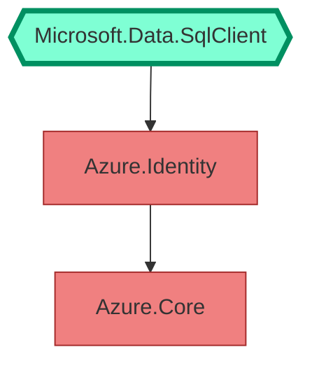

# Changelog

All notable changes to this project will be documented in this file.

The format is based on [Keep a Changelog](https://keepachangelog.com/en/1.0.0/), and this project adheres to [Semantic Versioning](https://semver.org/spec/v2.0.0.html).

## [1.1.2][1.1.2] - 2025-02-17

* Chisel is now disabled by default during [design-time builds](https://github.com/dotnet/project-system/blob/main/docs/design-time-builds.md).
* Fixed a bug where Chisel would fail with a `MissingMethodException` when using the .NET SDK 9.0.200.
```
Method not found: 'System.Collections.Generic.IList`1<NuGet.LibraryModel.LibraryDependency> NuGet.ProjectModel.TargetFrameworkInformation.get_Dependencies()'.
   at Chisel.LockFileExtensions.ReadPackages(LockFile lockFile, String tfm, String rid, Predicate`1 filter)
   at Chisel.Chisel.ProcessGraph() in /_/src/Chisel/Chisel.cs:line 178
   at Chisel.Chisel.Execute() in /_/src/Chisel/Chisel.cs:line 137
```

## [1.1.1][1.1.1] - 2024-11-07

* Fixed a bug where Chisel could fail in Visual Studio with a `MissingMethodException`.
```
Method not found: 'NuGet.Frameworks.NuGetFramework NuGet.ProjectModel.TargetFrameworkInformation.get_FrameworkName()'.
   at Chisel.LockFileExtensions.ReadPackages(LockFile lockFile, String tfm, String rid, Predicate`1 filter)
   at Chisel.Chisel.ProcessGraph() in /_/src/Chisel/Chisel.cs:line 161
   at Chisel.Chisel.Execute() in /_/src/Chisel/Chisel.cs:line 140
```

This issue was only affecting Visual Studio. Rider and the `dotnet` command line interface were not affected.

## [1.1.0][1.1.0] - 2024-09-13

* The `ChiselGraphIgnore` items now support simple globbing. For example to ignore all packages starting with `System.` in the graph, use the following syntax:

```xml
<ItemGroup>
  <ChiselGraphIgnore Include="System.*" />
</ItemGroup>
```

* The dependency graph roots (i.e. direct package and project references) are now identified with an hexagon shape and stronger borders.



## [1.0.0][1.0.0] - 2024-04-12

* Fix a crash when MSBuild is running on the desktop .NET Framework

## [1.0.0-rc.2][1.0.0-rc.2] - 2024-03-16

* The wording of some warnings has been improved
* The README has a paragraph on removing the Azure SDK from `Microsoft.Data.SqlClient`
* Readability of Mermaid graphs in dark mode has been improved

## [1.0.0-rc.1][1.0.0-rc.1] - 2024-03-15

Initial release on NuGet

[1.1.2]: https://github.com/0xced/Chisel/compare/1.1.1...1.1.2
[1.1.1]: https://github.com/0xced/Chisel/compare/1.1.0...1.1.1
[1.1.0]: https://github.com/0xced/Chisel/compare/1.0.0...1.1.0
[1.0.0]: https://github.com/0xced/Chisel/compare/1.0.0-rc.2...1.0.0
[1.0.0-rc.2]: https://github.com/0xced/Chisel/compare/1.0.0-rc.1...1.0.0-rc.2
[1.0.0-rc.1]: https://github.com/0xced/Chisel/releases/tag/1.0.0-rc.1
