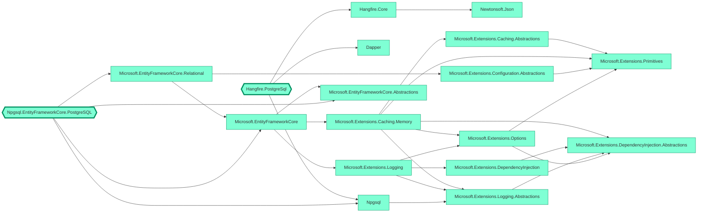
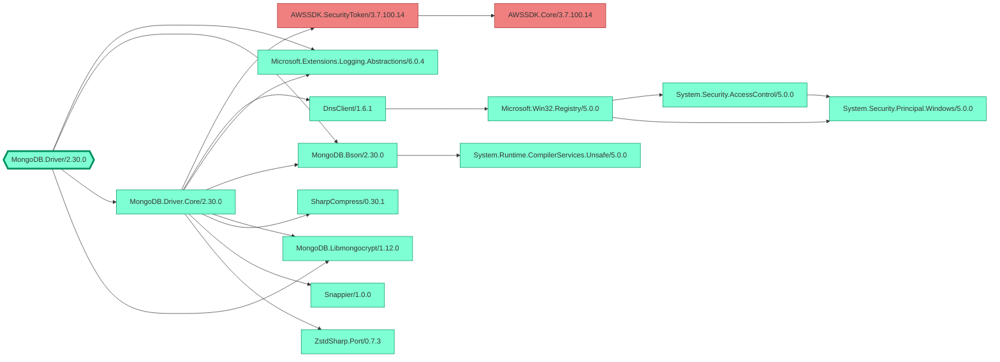
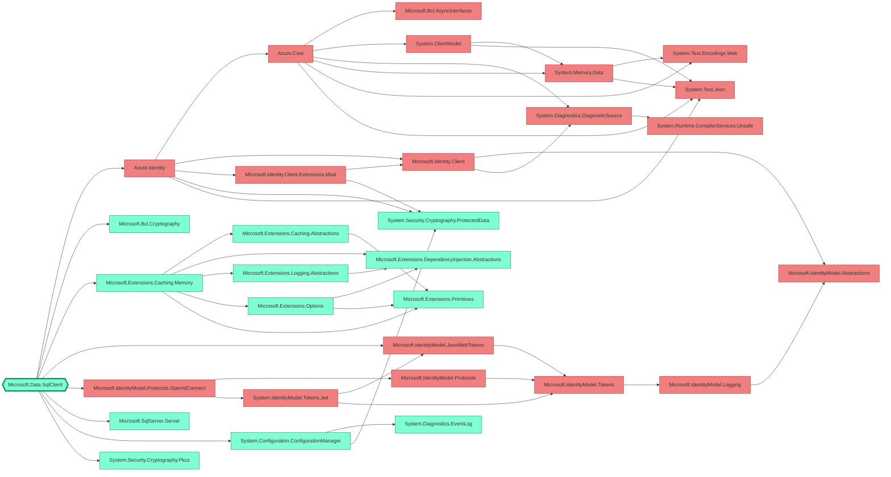
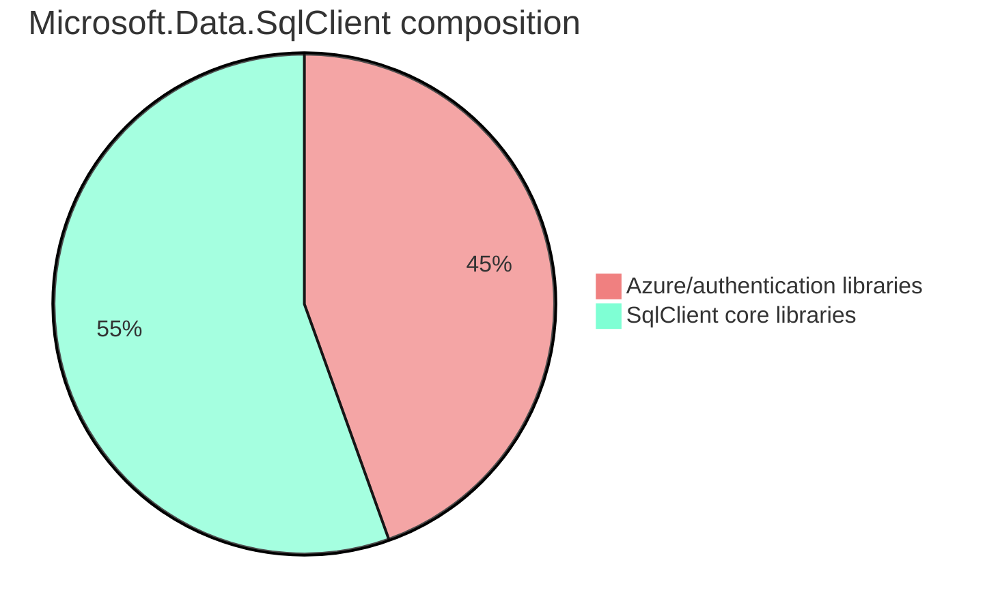
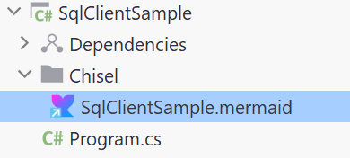
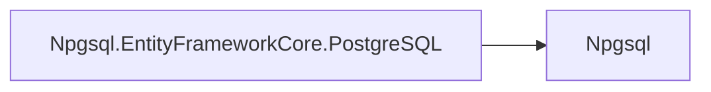
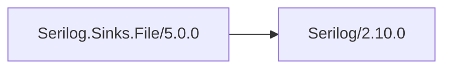

<p align="center">
  
</p>

**Chisel** provides a way to remove unwanted dependencies from your dotnet projects.

[](https://www.nuget.org/packages/Chisel/) [](https://github.com/0xced/Chisel/actions/workflows/continuous-integration.yml)

Chisel was born because some database drivers can't resist taking dependencies on cloud libraries. The [MongoDB driver](https://www.nuget.org/packages/MongoDB.Driver) (version 2.*) depends on the ASW SDK for authentication with Identity and Access Management (IAM) and [Microsoft's SQL Server driver](https://www.nuget.org/packages/Microsoft.Data.SqlClient) depends on the Azure SDK for authentication with the Microsoft identity platform (formerly Azure AD).

Users have asked for separate NuGet packages for both MongoDB ([issue #4635](https://jira.mongodb.org/browse/CSHARP-4635)) and SqlClient ([issue #1108](https://github.com/dotnet/SqlClient/issues/1108)) but as of `MongoDB.Driver` 2.* and `Microsoft.Data.SqlClient` 6.* the cloud dependencies are unavoidable, even if MongoDB or SQL Server is used on premises (where cloud authentication is obviously not needed).

> [!NOTE]  
> Chisel is no longer needed starting with version 3.0.0 of the `MongoDB.Driver` package since AWS authentication has been moved into a new optional [MongoDB.Driver.Authentication.AWS](https://www.nuget.org/packages/MongoDB.Driver.Authentication.AWS) package. See [Version 3.0 Breaking Changes](https://www.mongodb.com/docs/drivers/csharp/current/upgrade/v3/#version-3.0-breaking-changes) for more information.

Enter Chisel to remove those dependencies and save some precious megabytes.

## Getting started

Add the [Chisel](https://www.nuget.org/packages/Chisel/) NuGet package to your project using the NuGet Package Manager or run the following command:

```sh
dotnet add package Chisel
```

While Chisel's main purpose is removing unwanted dependencies from existing NuGet packages, it provides another great feature: a graph of your project's dependencies. After adding Chisel, a [Mermaid](https://mermaid.js.org) (or [Graphviz](https://graphviz.org)) graph is written in the intermediate output path (aka the `obj` directory).

For a project referencing `Hangfire.PostgreSql` and `Npgsql.EntityFrameworkCore.PostgreSQL` the graph would look like this.



Mermaid graphs can be used directly in [markdown files on GitHub](https://github.blog/2022-02-14-include-diagrams-markdown-files-mermaid/) and are rendered as graphs, just like the one just above. Or they can also be edited, previewed and shared with the [Mermaid live editor](https://mermaid.live/).

Graphviz (DOT) files can be written instead by setting the `ChiselGraphName` property to a name that ends with `.gv`:

```xml
<PropertyGroup>
  <ChiselGraphName>$(MSBuildProjectName).Chisel.gv</ChiselGraphName>
</PropertyGroup>
```

Graphviz files can be visualized and shared online with [Edotor](https://edotor.net) or locally with the excellent [Graphviz Interactive Preview](https://marketplace.visualstudio.com/items?itemName=tintinweb.graphviz-interactive-preview) extension for Visual Studio Code.

> [!WARNING]  
> While this technique has been sucessfully tested with the MongDB driver and the SQL Server driver, removing dependencies from a package might lead to exceptions at runtime. Make sure to properly test your application.

## Removing the AWS SDK from `MongoDB.Driver` version 2.*

After adding the `Chisel` package to your project, tell it to remove the `AWSSDK.SecurityToken` dependency with the `ChiselPackage` property.

```xml
<PropertyGroup>
  <ChiselPackage>AWSSDK.SecurityToken</ChiselPackage>
</PropertyGroup>
```

Specifying the _direct_ dependencies is enough. Looking at the produced graph confirms that Chisel figured out the transitive dependencies by itself (there's only `AWSSDK.Core` in this scenario).



Now, both `AWSSDK.Core.dll` and `AWSSDK.SecurityToken.dll` have disappeared from the build output.

As long as the [MONGODB-AWS authentication mechanism](https://www.mongodb.com/docs/drivers/csharp/current/fundamentals/authentication/#std-label-csharp-mongodb-aws) is not used everything will work fine. See the `MongoDbSample` project in the `samples` directory.

## Removing the Azure SDK from `Microsoft.Data.SqlClient` version 6.*

Getting rid of the Azure/Microsoft Identity bits requires defining three packages to remove. In the previous example, `<ChiselPackage>` was used as an MSBuild property. Here, it's used as an MSBuild item (i.e. with the `Include` attribute) to specify multiple packages.

```xml
<ItemGroup>
  <ChiselPackage Include="Azure.Identity" />
  <ChiselPackage Include="Microsoft.IdentityModel.JsonWebTokens" />
  <ChiselPackage Include="Microsoft.IdentityModel.Protocols.OpenIdConnect" />
</ItemGroup>
```

As with the MongoDB driver, specifying the three _direct_ dependencies is enough. We can see in the produced graph that the `Microsoft.Identity*` libraries have many transitive dependencies which are also removed (in red).



For `Microsoft.Data.SqlClient` prior to version 6, an additional trick is required to get rid of the `Microsoft.Identity.Client` dependency. See a [previous version](https://github.com/0xced/Chisel/blob/1.1.1/README.md#removing-the-azure-sdk-from-microsoftdatasqlclient) of the README for more information.

On macOS, removing the Azure authentication libraries and its dependencies reduces the size of the dlls from 5.6 MiB down to 3.1 MiB. In other words, the Azure librarires are responsible fore almost 50% of the size of the `Microsoft.Data.SqlClient` (6.0.1) package.



Have a look at the `SqlClientSample` project in the `samples` directory for a concrete example.

## Advanced configuration

Here are all the MSBuild properties and items supported by Chisel.

### `ChiselEnabled`

defaults to `true` for standard builds and `false` for [design-time builds](https://github.com/dotnet/project-system/blob/main/docs/design-time-builds.md)

In order to completely disable Chisel, set the `ChiselEnabled` property to `false`. This can be useful for building on the command line with `dotnet build -p:ChiselEnabled=false` for example.

### `ChiselGraphName`

defaults to `$(MSBuildProjectName).Chisel.mermaid`

This is the name of the dependency graph file. A Mermaid file will be written if it ends with either `.mmd` or `.mermaid`, otherwise a Graphviz (DOT) file will be written. To completely disable the graph feature, use `none`.

```xml
<PropertyGroup>
  <ChiselGraphName>none</ChiselGraphName>
</PropertyGroup>
```

Note that the file name must not include a path separator.

### `ChiselGraphAlias`

no default value

Setting the `ChiselGraphAlias` property adds an alias (link) under the project. This is useful to see the graph directly into the IDE. A very good combination with the Rider [Mermaid plugin](https://plugins.jetbrains.com/plugin/20146-mermaid). 



```xml
<PropertyGroup>
  <ChiselGraphAlias>Chisel\SqlClientSample.mermaid</ChiselGraphAlias>
</PropertyGroup>
```

### `ChiselGraphDirection`

defaults to `LeftToRight`

This defines how the dependency graph is laid out. Possible values are `LeftToRight` and `TopToBottom`. Except for shallow graphs, left to right usually produces a more readable graph.

### `ChiselGraphIncludeLinks`

defaults to `true`

Since version 1.2.0, all nodes of the graph contains clickable links to their corresponding nuget.org page.

For example, clicking on the `Npgsql` box below opens https://www.nuget.org/packages/Npgsql/9.0.3



To disable links, set the `ChiselGraphIncludeLinks` property to `false`.

```xml
<PropertyGroup>
  <ChiselGraphIncludeLinks>false</ChiselGraphIncludeLinks>
</PropertyGroup>
```

### `ChiselGraphIncludeVersions`

defaults to `false`

Controls whether the dependency graph nodes are named `{package}` or `{package}/{version}`.

Example with `ChiselGraphIncludeVersions` set to `false`


Example with `ChiselGraphIncludeVersions` set to `true`



### `ChiselGraphIgnore`

On real projects, the dependency graph may become huge. Adding packages to `ChiselGraphIgnore` will remove them from the dependency graph, thus reducing the overall size and increasing readability in other areas.

```xml
<ItemGroup>
  <ChiselGraphIgnore Include="Microsoft.Extensions.Configuration" />
  <ChiselGraphIgnore Include="Microsoft.Extensions.DependencyInjection" />
  <ChiselGraphIgnore Include="Microsoft.Extensions.Hosting" />
</ItemGroup>
```

Globbing is supported since version 1.1.0. For example to ignore all packages starting with `System.` in the graph, use the following syntax:

```xml
<ItemGroup>
  <ChiselGraphIgnore Include="System.*" />
</ItemGroup>
```