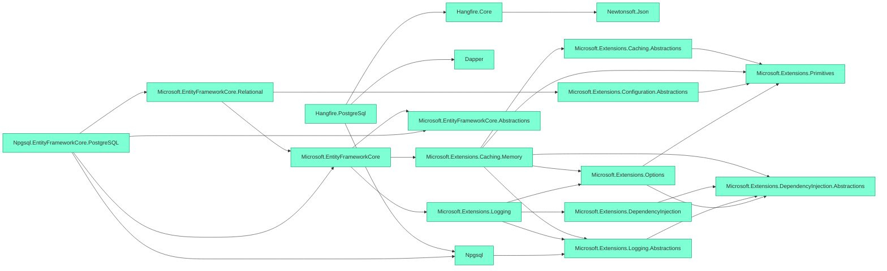
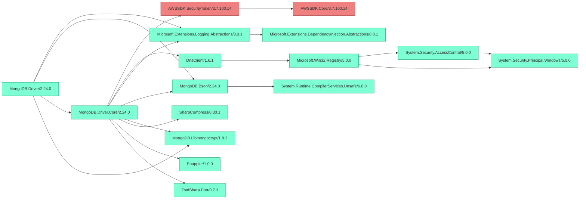
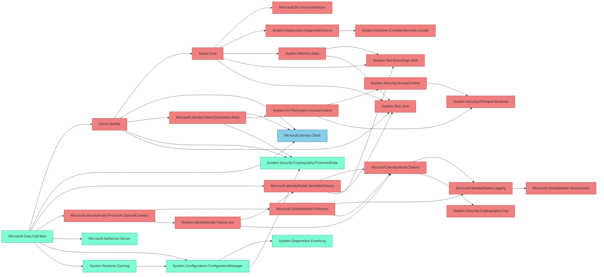
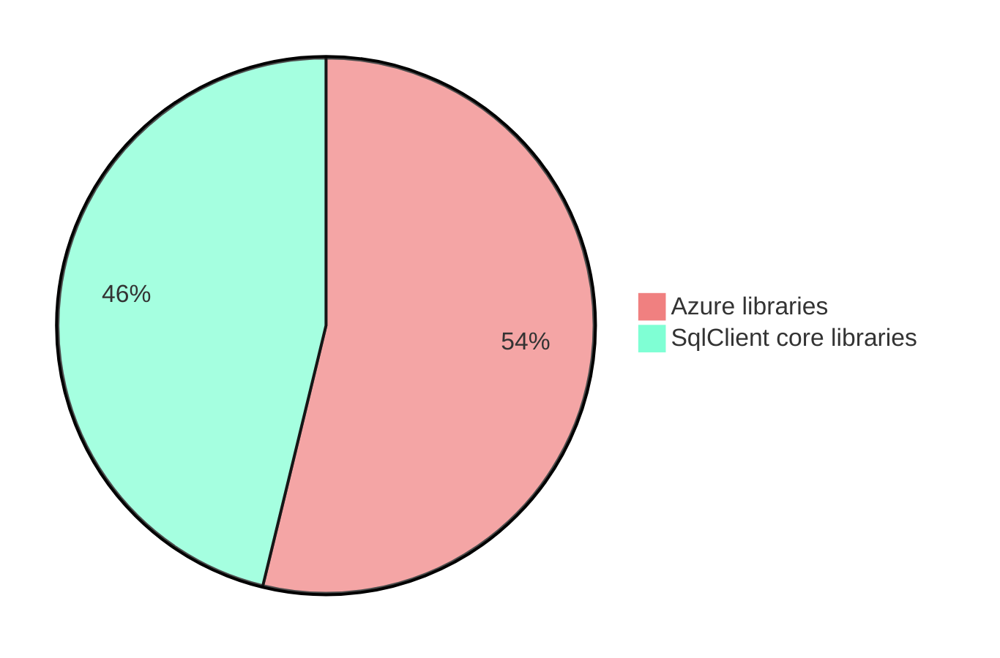

<p align="center">
  
</p>

**Chisel** provides a way to remove unwanted dependencies from your dotnet projects.

[](https://www.nuget.org/packages/Chisel/) [](https://github.com/0xced/Chisel/actions/workflows/continuous-integration.yml)

Chisel was born because some database drivers can't resist taking dependencies on cloud libraries. The [MongoDB driver](https://www.nuget.org/packages/MongoDB.Driver) depends on the ASW SDK for authentication with Identity and Access Management (IAM) and [Microsoft's SQL Server driver](https://www.nuget.org/packages/Microsoft.Data.SqlClient) depends on the Azure SDK for authentication with the Microsoft identity platform (formerly Azure AD).

Users have asked for separate NuGet packages for both MongoDB ([issue #4635](https://jira.mongodb.org/browse/CSHARP-4635)) and SqlClient ([issue #1108](https://github.com/dotnet/SqlClient/issues/1108)) but as of `MongoDB.Driver` 2.24.0 and `Microsoft.Data.SqlClient` 5.2.0 the cloud dependencies are unavoidable, even if MongoDB or SQL Server is used on premises (where cloud authentication is obviously not needed).

Enter Chisel to remove those dependencies and save some precious megabytes.

## Getting started

Add the [Chisel](https://www.nuget.org/packages/Chisel/) NuGet package to your project using the NuGet Package Manager or run the following command:

```sh
dotnet add package Chisel
```

While Chisel's main purpose is removing unwanted dependencies from existing NuGet packages, it provides another great feature: a graph of your project's dependencies. After adding Chisel, a [Mermaid](https://mermaid.js.org) (or [Graphviz](https://graphviz.org)) graph is written in the intermediate output path (aka the `obj` directory).

For a project referencing `Hangfire.PostgreSql` and `Npgsql.EntityFrameworkCore.PostgreSQL` the graph would look like this.



Mermaid graphs can be used directly in [markdown files on GitHub](https://github.blog/2022-02-14-include-diagrams-markdown-files-mermaid/) and are rendered as graphs, just like the one just above. Or they can also be edited, previewed and shared with the [Mermaid live editor](https://mermaid.live/).

Graphviz (DOT) files can be written instead by setting the `ChiselGraphName` property to a name that ends with `.gv`:

```xml
<PropertyGroup>
  <ChiselGraphName>$(MSBuildProjectName).Chisel.gv</ChiselGraphName>
</PropertyGroup>
```

Graphviz files can be visualized and shared online with [Edotor](https://edotor.net) or locally with the excellent [Graphviz Interactive Preview](https://marketplace.visualstudio.com/items?itemName=tintinweb.graphviz-interactive-preview) extension for Visual Studio Code.

> [!WARNING]  
> While this technique has been sucessfully tested with the MongDB driver and the SQL Server driver, removing dependencies from a package might lead to exceptions at runtime. Make sure to properly test your application.

## Removing the AWS SDK from `MongoDB.Driver`

After adding the `Chisel` package to your project, tell it to remove the `AWSSDK.SecurityToken` dependency with the `ChiselPackage` property.

```xml
<PropertyGroup>
  <ChiselPackage>AWSSDK.SecurityToken</ChiselPackage>
</PropertyGroup>
```

Specifying the _direct_ dependencies is enough. Looking at the produced graph confirms that Chisel figured out the transitive dependencies by itself (there's only `AWSSDK.Core` in this scenario).



Now, both `AWSSDK.Core.dll` and `AWSSDK.SecurityToken.dll` have disappeared from the build output.

As long as the [MONGODB-AWS authentication mechanism](https://www.mongodb.com/docs/drivers/csharp/current/fundamentals/authentication/#std-label-csharp-mongodb-aws) is not used everything will work fine. See the `MongoDbSample` project in the `samples` directory.

## Removing the Azure SDK from `Microsoft.Data.SqlClient`

Getting rid of the Azure/Microsoft Identity bits requires defining three packages to remove plus an additional trick. In the previous example, `<ChiselPackage>` was used as an MSBuild property. Here, it's used as an MSBuild item (i.e. with the `Include` attribute) to specify multiple packages.

```xml
<ItemGroup>
  <ChiselPackage Include="Azure.Identity" />
  <ChiselPackage Include="Microsoft.IdentityModel.JsonWebTokens" />
  <ChiselPackage Include="Microsoft.IdentityModel.Protocols.OpenIdConnect" />
</ItemGroup>
```

As with the MongoDB driver, specifying the three _direct_ dependencies is enough. We can see in the produced graph that the `Microsoft.Identity*` libraries have many transitive dependencies which are also removed (in red).



Notice how `Microsoft.Identity.Client` is in blue (meaning it's a project reference instead of a package reference). That's because the `Microsoft.Identity.Client` package can't be easily removed, else the following exception would be thrown at runtime when opening a connection.

```
System.TypeInitializationException: The type initializer for 'Microsoft.Data.SqlClient.SqlAuthenticationProviderManager' threw an exception.
 ---> System.IO.FileNotFoundException: Could not load file or assembly 'Microsoft.Identity.Client, Version=4.56.0.0, Culture=neutral, PublicKeyToken=0a613f4dd989e8ae'. The system cannot find the file specified.
```

But it's possible to workaround this problem! Since the `Microsoft.Identity.Client` dll is required, we can create one with the absolute minimum required for the `SqlAuthenticationProviderManager` class to be happy.

1. Create a project named `Microsoft.Identity.Client` with the following content (also available in the `samples` directory):

```xml
<Project Sdk="Microsoft.NET.Sdk">

  <PropertyGroup>
    <TargetFramework>netstandard2.0</TargetFramework>
    <DebugType>none</DebugType>
    <Version>4.56.0</Version>
    <SignAssembly>true</SignAssembly>
    <AssemblyOriginatorKeyFile>$(BaseIntermediateOutputPath)MSAL.snk</AssemblyOriginatorKeyFile>
  </PropertyGroup>

  <Target Name="DownloadMsalKey" BeforeTargets="ResolveKeySource" Condition="!Exists($(AssemblyOriginatorKeyFile))">
    <DownloadFile SourceUrl="https://github.com/AzureAD/microsoft-authentication-library-for-dotnet/raw/$(Version)/build/MSAL.snk" DestinationFolder="$(BaseIntermediateOutputPath)" />
  </Target>

</Project>
```

2. Add a single C# file with the following content:

```csharp
namespace Microsoft.Identity.Client
{
    public class DeviceCodeResult
    {
    }
}
```

3. Add a reference in your project:

```xml
<ItemGroup>
  <ProjectReference Include="../Microsoft.Identity.Client/Microsoft.Identity.Client.csproj" />
</ItemGroup>
```

And that's enough for the dotnet build system to pick the **project** reference instead of the **package** reference of the same name, thus reducing the size of `Microsoft.Identity.Client.dll` from 1 MB to 5 KB.

On macOS, removing the Azure authentication libraries and its dependencies reduces the size of the dlls from 6 MB down to 2.8 MB. In other words, the Azure librarires are responsible fore more than 50% of the size of the `Microsoft.Data.SqlClient` package.



Have a look at the `SqlClientSample` project in the `samples` directory for a concrete example.

## Advanced configuration

Here are all the MSBuild properties and items supported by Chisel.

### `ChiselEnabled`

defaults to `true`

In order to completely disable Chisel, set the `ChiselEnabled` property to `false`. This can be useful for building on the command line with `dotnet build -p:ChiselEnabled=false` for example.

### `ChiselGraphName`

defaults to `$(MSBuildProjectName).Chisel.mermaid`

This is the name of the dependency graph file. A Mermaid file will be written if it ends with either `.mmd` or `.mermaid`, otherwise a Graphviz (DOT) file will be written. To completely disable the graph feature, use `none`.

```xml
<PropertyGroup>
  <ChiselGraphName>none</ChiselGraphName>
</PropertyGroup>
```

Note that the file name must not include a path separator.

### `ChiselGraphAlias`

no default value

Setting the `ChiselGraphAlias` property adds an alias (link) under the project. This is useful to see the graph directly into the IDE. A very good combination with the Rider [Mermaid plugin](https://plugins.jetbrains.com/plugin/20146-mermaid). 


```xml
<PropertyGroup>
  <ChiselGraphAlias>Chisel\SqlClientSample.mermaid</ChiselGraphAlias>
</PropertyGroup>
```

### `ChiselGraphDirection`

defaults to `LeftToRight`

This defines how the dependency graph is laid out. Possible values are `LeftToRight` and `TopToBottom`. Except for shallow graphs, left to right usually produce a more readable graph.

### `ChiselGraphIncludeVersions`

defaults to `false`

Controls whether the dependency graph nodes are named `{package}` or `{package}/{version}`.

Example with `ChiselGraphIncludeVersions` set to `false`


Example with `ChiselGraphIncludeVersions` set to `true`


### `ChiselGraphIgnore`

On real projects, the dependency graph may become huge. Adding packages to `ChiselGraphIgnore` will remove them from the dependency graph, thus reducing the overall size and increasing readability in other areas.

```xml
<ItemGroup>
  <ChiselGraphIgnore Include="Microsoft.Extensions.Configuration" />
  <ChiselGraphIgnore Include="Microsoft.Extensions.DependencyInjection" />
  <ChiselGraphIgnore Include="Microsoft.Extensions.Hosting" />
</ItemGroup>
```